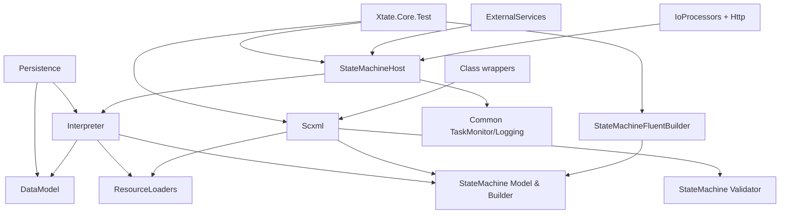

# Repository Catalog

## Overview

Xtate.Core is a modular C# state-machine framework implementing SCXML. Architecture is composition-root driven: feature modules expose abstractions and services, then wire them through `Xtate.IoC` `Module` classes (especially `StateMachineProcessorModule`, `ScxmlModule`, and `StateMachineInterpreterModule`).

## Modules

### Core State Machine Model and Builder

| Field | Value |
|---|---|
| Path | `src/Xtate.Core/StateMachine` |
| Project | `Xtate.Core` |
| Visibility | Mixed |
| Main responsibility | Defines SCXML model contracts/entities and provides builder + validator infrastructure |
| Main types | `IStateMachine`, `IState`, `ITransition`, `IStateMachineBuilder`, `StateMachineBuilderModule`, `StateMachineValidator` |
| Depends on | Data model contracts; validator services |
| Used by | Interpreter, SCXML, Fluent builder, tests |

#### Description

This module is the canonical domain model for state-machine definitions. It provides interfaces/entities, construction APIs, model visitor logic, and structural validation.

#### Key files

- `src/Xtate.Core/StateMachine/Abstractions/IStateEntity.cs` — base contract for state-like nodes.
- `src/Xtate.Core/StateMachine/Builder/Abstractions/IStateMachineBuilder.cs` — builder contract used by SCXML and fluent APIs.
- `src/Xtate.Core/StateMachine/Builder/DependencyInjection/StateMachineBuilderModule.cs` — registers all builder services.
- `src/Xtate.Core/StateMachine/Validator/Services/StateMachineValidator.cs` — semantic validation rules.

#### Dependencies

- **Interface/abstraction dependency:** `IDataModel*`, executable entity interfaces.
- **Dependency injection registration:** `StateMachineBuilderModule` and `ValidatorModule` register concrete builders/validators.
- **Conceptual dependency:** model is consumed by interpreter and serializers.

#### Notes

Contains both public contracts and internal implementation details; avoid placing host/runtime side effects here.

### Interpreter Runtime

| Field | Value |
|---|---|
| Path | `src/Xtate.Core/Interpreter` |
| Project | `Xtate.Core` |
| Visibility | Mixed |
| Main responsibility | Executes built state-machine models, drives event loop, invoke lifecycle, and runtime state |
| Main types | `IStateMachineInterpreter`, `StateMachineInterpreter`, `InterpreterModelBuilder`, `StateMachineInterpreterModule` |
| Depends on | StateMachine model, DataModel handlers, ResourceLoaders, IoC utilities |
| Used by | StateMachineHost, Persistence, tests |

#### Description

Builds an interpreter model from state-machine definitions and runs SCXML execution semantics, including transitions, queues, invoke handling, and runtime error propagation.

#### Key files

- `src/Xtate.Core/Interpreter/Services/StateMachineInterpreter.cs` — main execution engine.
- `src/Xtate.Core/Interpreter/ModelBuilder/Services/InterpreterModelBuilder.cs` — transforms model entities to optimized interpreter nodes.
- `src/Xtate.Core/Interpreter/DependencyInjection/StateMachineInterpreterModule.cs` — runtime composition.
- `src/Xtate.Core/Interpreter/ModelBuilder/DependencyInjection/InterpreterModelBuilderModule.cs` — node factory registrations.

#### Dependencies

- **Direct code dependency:** uses `Xtate.StateMachine`, `Xtate.DataModel`, `Xtate.Logging`.
- **Dependency injection registration:** module chain pulls in `DataModelHandlersModule`, `ResourceLoadersModule`, `IoCModule`.
- **Conceptual dependency:** depends on validator correctness of model inputs.

#### Notes

`IStateMachineInterpreter` is the primary runtime execution abstraction.

### Data Model Handlers

| Field | Value |
|---|---|
| Path | `src/Xtate.Core/DataModel` |
| Project | `Xtate.Core` |
| Visibility | Mixed |
| Main responsibility | Evaluates expressions/actions for runtime, null, and XPath data models |
| Main types | `IDataModelHandler`, `DataModelHandlerService`, `RuntimeDataModelHandler`, `XPathDataModelHandler`, `NullDataModelHandler` |
| Depends on | StateMachine abstractions, Validator, NameTable, IoC |
| Used by | Interpreter and persistence model-building |

#### Description

Provides pluggable data-model execution implementations. Handler providers are registered via DI modules and selected at runtime by data-model type.

#### Key files

- `src/Xtate.Core/DataModel/DependencyInjection/DataModelHandlersModule.cs` — top-level handler composition.
- `src/Xtate.Core/DataModel/DependencyInjection/DataModelHandlerBaseModule.cs` — shared evaluator defaults.
- `src/Xtate.Core/DataModel/Handlers/Runtime/DependencyInjection/RuntimeDataModelHandlerModule.cs` — runtime evaluator registration.
- `src/Xtate.Core/DataModel/Handlers/XPath/DependencyInjection/XPathDataModelHandlerModule.cs` — XPath engine integration.

#### Dependencies

- **Interface/abstraction dependency:** expression/action interfaces from `StateMachine`.
- **Dependency injection registration:** nested modules for runtime/null/xpath handlers.
- **Direct code dependency:** XPath handler depends on `NameTable` and XPath-specific services.

#### Notes

Module selection is data-model-type driven (`runtime`, `xpath`, etc.).

### SCXML Serialization and Parsing

| Field | Value |
|---|---|
| Path | `src/Xtate.Core/Scxml` |
| Project | `Xtate.Core` |
| Visibility | Mixed |
| Main responsibility | Converts SCXML XML to/from state-machine model, including XInclude and XML resolver flow |
| Main types | `IScxmlDeserializer`, `IScxmlSerializer`, `ScxmlDeserializer`, `ScxmlSerializer`, `ScxmlModule` |
| Depends on | StateMachine builder/validator, ResourceLoaders, NameTable |
| Used by | Class wrappers (`LocationStateMachine`, `ScxmlStateMachine`), tests |

#### Description

Handles XML-reader/writer orchestration for SCXML and validates generated model objects before execution.

#### Key files

- `src/Xtate.Core/Scxml/DependencyInjection/ScxmlModule.cs` — SCXML composition root.
- `src/Xtate.Core/Scxml/Services/ScxmlDeserializer.cs` — XML -> model flow with optional XInclude.
- `src/Xtate.Core/Scxml/Services/ScxmlLocationStateMachineGetter.cs` — loads from location URI.
- `src/Xtate.Core/Scxml/Services/XIncludeReader.cs` — XInclude expansion support.

#### Dependencies

- **Dependency injection registration:** imports `StateMachineBuilderModule`, `ResourceLoadersModule`, `ValidatorModule`, `NameTableModule`.
- **Direct code dependency:** uses XML primitives and resolver abstractions.
- **Conceptual dependency:** relies on resource loader schemes (`resx://`, file/http).

#### Notes

XInclude behavior is controlled through `IXIncludeOptions` (from `StateMachineOptions`).

### Resource Loading

| Field | Value |
|---|---|
| Path | `src/Xtate.Core/ResourceLoaders` |
| Project | `Xtate.Core` |
| Visibility | Mixed |
| Main responsibility | Unified URI-based loading of external resources via pluggable providers |
| Main types | `IResourceLoader`, `IResourceLoaderProvider`, `ResourceLoaderService`, `ResourceLoadersModule` |
| Depends on | IoBoundTask, Http module, IoC, interpreter location context |
| Used by | SCXML and interpreter model builder |

#### Description

Resolves resources by iterating provider implementations (file, resx, web). Supports relative URI resolution against current state-machine location.

#### Key files

- `src/Xtate.Core/ResourceLoaders/Services/ResourceLoaderService.cs` — dispatches URI requests to providers.
- `src/Xtate.Core/ResourceLoaders/DependencyInjection/ResourceLoadersModule.cs` — aggregates provider modules.
- `src/Xtate.Core/ResourceLoaders/Handlers/File/DependencyInjection/FileResourceLoaderModule.cs` — file provider registration.
- `src/Xtate.Core/ResourceLoaders/Handlers/Web/DependencyInjection/WebResourceLoaderModule.cs` — web provider registration.

#### Dependencies

- **Interface/abstraction dependency:** depends on `IStateMachineLocation` when available.
- **Dependency injection registration:** composed from file/resx/web modules.
- **Direct code dependency:** web handler uses `HttpModule` and IoC services.

#### Notes

Provider-order semantics matter when multiple providers can handle similar URI forms.

### Hosting and Runtime Orchestration

| Field | Value |
|---|---|
| Path | `src/Xtate.Core/StateMachineHost` |
| Project | `Xtate.Core` |
| Visibility | Mixed |
| Main responsibility | Manages state-machine scopes, external services, event routing, scheduling, and security context |
| Main types | `IStateMachineScopeManager`, `StateMachineScopeManager`, `StateMachineProcessorModule`, `StateMachineRuntimeController` |
| Depends on | Interpreter runtime, DataModel abstractions, IoC, TaskMonitor |
| Used by | Application entry composition, IoProcessor modules, tests |

#### Description

Acts as runtime host layer above the interpreter. Creates per-session scopes, registers controllers, dispatches internal/external events, and manages external-service lifecycle.

#### Key files

- `src/Xtate.Core/StateMachineHost/DependencyInjection/StateMachineProcessorModule.cs` — main runtime composition entry.
- `src/Xtate.Core/StateMachineHost/Services/StateMachineScopeManager.cs` — session scope lifecycle management.
- `src/Xtate.Core/StateMachineHost/DependencyInjection/ExternalServiceModule.cs` — external service orchestration.
- `src/Xtate.Core/StateMachineHost/DependencyInjection/EventSchedulerModule.cs` — scheduler registration.

#### Dependencies

- **Dependency injection registration:** `StateMachineProcessorModule` depends on `ExternalServiceModule`, `EventSchedulerModule`, `StateMachineInterpreterModule`, `TaskMonitorModule`.
- **Direct code dependency:** runtime controllers depend on interpreter/data model interfaces.
- **Conceptual dependency:** security-context registration gates execution mode.

#### Notes

This is the main integration module consumers typically add first.

### StateMachineClass Entry Wrappers

| Field | Value |
|---|---|
| Path | `src/Xtate.Core/Class` |
| Project | `Xtate.Core` |
| Visibility | Public |
| Main responsibility | Public entry abstractions for supplying state machines from runtime object, URI, string, or stream |
| Main types | `StateMachineClass`, `RuntimeStateMachine`, `LocationStateMachine`, `ScxmlStateMachine`, `ScxmlStringStateMachine` |
| Depends on | SCXML module, StateMachine model, interpreter abstractions |
| Used by | `IStateMachineScopeManager` callers and tests |

#### Description

Provides high-level object model for execution inputs and wiring of required per-state-machine services.

#### Key files

- `src/Xtate.Core/Class/DependencyInjection/StateMachineClass.cs` — base wrapper + service forwarding.
- `src/Xtate.Core/Class/DependencyInjection/RuntimeStateMachine.cs` — wraps in-memory `IStateMachine`.
- `src/Xtate.Core/Class/DependencyInjection/LocationStateMachine.cs` — URI-based loading path.
- `src/Xtate.Core/Class/DependencyInjection/ScxmlStateMachine.cs` — reader-based SCXML path.

#### Dependencies

- **Interface/abstraction dependency:** implements `IStateMachineSessionId`, `IStateMachineArguments`, `IStateMachineLocation`.
- **Dependency injection registration:** wrapper adds `ScxmlModule` and getter factories where needed.

#### Notes

Despite folder name `DependencyInjection`, this area is public API for runtime invocation shapes.

### Fluent Builder API

| Field | Value |
|---|---|
| Path | `src/Xtate.Core/StateMachineFluentBuilder` |
| Project | `Xtate.Core` |
| Visibility | Public |
| Main responsibility | Offers fluent C# DSL over state-machine builder interfaces |
| Main types | `StateMachineFluentBuilder`, `StateFluentBuilder<T>`, `StateMachineFluentBuilderModule` |
| Depends on | StateMachine builder module |
| Used by | Tests and consumers preferring fluent construction |

#### Description

Provides convenience API to assemble state-machine models without directly manipulating low-level builder interfaces.

#### Key files

- `src/Xtate.Core/StateMachineFluentBuilder/Abstractions/StateMachineFluentBuilder.cs` — top-level fluent API.
- `src/Xtate.Core/StateMachineFluentBuilder/DependencyInjection/StateMachineFluentBuilderModule.cs` — fluent service registrations.

#### Dependencies

- **Dependency injection registration:** depends on `StateMachineBuilderModule`.
- **Interface/abstraction dependency:** emits `IStateMachine` through underlying builder contracts.

#### Notes

Thin layer; business semantics stay in `StateMachine` + interpreter modules.

### Persistence Layer

| Field | Value |
|---|---|
| Path | `src/Xtate.Core/Persistence` |
| Project | `Xtate.Core` |
| Visibility | Mixed |
| Main responsibility | Persists interpreter context/model state and provides storage abstractions/providers |
| Main types | `PersistenceModule`, `IStorage`, `ITransactionalStorage`, `StateMachinePersistingInterpreter`, `StateMachinePersistedContext` |
| Depends on | Interpreter runtime/model builder, DataModel handlers, IoC transform args |
| Used by | Persistence-focused runtime scenarios and tests |

#### Description

Adds persistence-aware interpreter/context implementations and storage mechanisms (in-memory and stream-backed).

#### Key files

- `src/Xtate.Core/Persistence/DependencyInjection/PersistenceModule.cs` — persistence composition root.
- `src/Xtate.Core/Persistence/Abstractions/IStorage.cs` — storage contract.
- `src/Xtate.Core/Persistence/Services/StateMachinePersistingInterpreter.cs` — persistence-enabled interpreter.
- `src/Xtate.Core/Persistence/Services/DefaultTransactionalStorage.cs` — transactional storage resolver.

#### Dependencies

- **Dependency injection registration:** depends on `StateMachineInterpreterModule`, `PersistenceInterpreterModelBuilderModule`, `DataModelHandlersModule`, `IoCModule`.
- **Interface/abstraction dependency:** exposes storage/persistence contracts consumed by host/interpreter context.

#### Notes

Persistence has parallel model-node sets (`Persistence/Model/...`) mirroring interpreter concepts.

### IoC Integration Utilities

| Field | Value |
|---|---|
| Path | `src/Xtate.Core/IoC` |
| Project | `Xtate.Core` |
| Visibility | Mixed |
| Main responsibility | Provides Xtate-specific DI helper modules (options, service arrays, ancestors, transform args, tools) |
| Main types | `IoCModule`, `OptionsModule`, `ServiceArrayModule`, `AncestorTrackerModule`, `TransformArgsModule` |
| Depends on | Xtate.IoC package |
| Used by | Nearly all composition modules |

#### Description

Cross-cutting registration helpers that standardize option resolution, ancestor tracking, argument transformation, and container utility types.

#### Key files

- `src/Xtate.Core/IoC/DependencyInjection/IoCModule.cs` — aggregate IoC helper module.
- `src/Xtate.Core/IoC/Options/DependencyInjection/OptionsModule.cs` — options wrappers.
- `src/Xtate.Core/IoC/ServiceArray/DependencyInjection/ServiceArrayModule.cs` — collection/list bindings.

#### Dependencies

- **Dependency injection registration:** pure composition module chain; no domain business logic.
- **Conceptual dependency:** central shared infrastructure used by other modules.

#### Notes

`IoCModule` is intentionally lightweight and declarative.

### I/O Processors and Transport Endpoints

| Field | Value |
|---|---|
| Path | `src/Xtate.Core/IoProcessors`, `src/Xtate.Core/Http` |
| Project | `Xtate.Core` |
| Visibility | Mixed |
| Main responsibility | Implements transport-specific event processors/hosts and HTTP client factory support |
| Main types | `HttpIoProcessor`, `NamedPipeIoProcessor`, `HttpIoProcessorModule`, `NamedPipeIoProcessorModule`, `HttpModule` |
| Depends on | StateMachineHost abstractions, Interpreter interfaces, Http services |
| Used by | Runtime host configurations requiring external transport |

#### Description

Adds SCXML IO-processor implementations (HTTP and named pipe) and related transport plumbing.

#### Key files

- `src/Xtate.Core/IoProcessors/Http/Services/HttpIoProcessor.cs` — HTTP event processor behavior.
- `src/Xtate.Core/IoProcessors/NamedPipe/Services/NamedPipeIoProcessor.cs` — named-pipe event processor behavior.
- `src/Xtate.Core/IoProcessors/Http/DependencyInjection/HttpIoProcessorModule.cs` — HTTP processor module.
- `src/Xtate.Core/Http/DependencyInjection/HttpModule.cs` — scoped `HttpClient` factory registration.

#### Dependencies

- **Dependency injection registration:** processor modules depend on `StateMachineProcessorModule`.
- **Direct code dependency:** processors route through host dispatchers/controllers.

#### Notes

HTTP transport support is split between generic `Http` utilities and IO-processor-specific implementation.

### External Service Connectors

| Field | Value |
|---|---|
| Path | `src/Xtate.Core/ExternalServices` |
| Project | `Xtate.Core` |
| Visibility | Mixed |
| Main responsibility | Implements invoke-able external services (HTTP client and SMTP) and provider registration |
| Main types | `ExternalServicesModule`, `HttpClientService`, `SmtpClientService`, `IExternalServiceProvider` |
| Depends on | StateMachineHost external service abstractions, DataModel types |
| Used by | Host external service manager and invoke execution |

#### Description

Contains concrete external service implementations and their provider metadata for invoke dispatch.

#### Key files

- `src/Xtate.Core/ExternalServices/DependencyInjection/ExternalServicesModule.cs` — aggregate services module.
- `src/Xtate.Core/ExternalServices/HttpClient/Services/HttpClientService.cs` — HTTP external service behavior.
- `src/Xtate.Core/ExternalServices/SmtpClient/Services/SmtpClientService.cs` — SMTP external service behavior.

#### Dependencies

- **Dependency injection registration:** specific service modules register `IExternalServiceProvider` implementations.
- **Interface/abstraction dependency:** inherits `ExternalServiceBase` and uses state-machine data model payloads.

#### Notes

Large protocol-specific behavior currently resides directly in service classes.

### Shared Core Utilities and Data Types

| Field | Value |
|---|---|
| Path | `src/Xtate.Core/Common`, `src/Xtate.Core/DataTypes`, `src/Xtate.Core/Actions`, `src/Xtate.Core/StateMachineOptions` |
| Project | `Xtate.Core` |
| Visibility | Mixed |
| Main responsibility | Provides foundational helpers, data value types, system actions, and option adapters |
| Main types | `Infra`, `DataModelValue`, `DataModelList`, `ActionBase`, `StateMachineOptionsProvider` |
| Depends on | Cross-cutting framework primitives |
| Used by | All production modules |

#### Description

Houses cross-cutting primitives: exceptions, helpers, logging/task monitor utilities, polyfills, data model value structures, system actions, and runtime options mapping.

#### Key files

- `src/Xtate.Core/Common/Helpers/Infra.cs` — shared guard/error helpers.
- `src/Xtate.Core/DataTypes/Model/DataModelValue.cs` — central data value representation.
- `src/Xtate.Core/Actions/Abstractions/ActionBase.cs` — custom action base abstraction.
- `src/Xtate.Core/StateMachineOptions/Services/StateMachineOptionsProvider.cs` — maps `StateMachineOptions` to option interfaces.

#### Dependencies

- **Direct code dependency:** consumed by interpreter, host, services, and serializers.
- **Dependency injection registration:** options/logging/task-monitor modules provide container-level support.

#### Notes

This is a broad support area; responsibilities are related but not strictly isolated.

### Test and Test Infrastructure Modules

| Field | Value |
|---|---|
| Path | `test/Xtate.Core.Test` |
| Project | `Xtate.Core.Test` |
| Visibility | Internal (test assembly) |
| Main responsibility | Validates runtime behavior, DI composition, SCXML processing, and persistence scenarios |
| Main types | `HostedTestBase`, `StateMachineInterpreterDiTest`, `FluentBuilderTest`, `FinalStateTest` |
| Depends on | `Xtate.Core` modules via project reference |
| Used by | CI/publish workflow and local verification |

#### Description

Organized into functional areas (`UnitTests`, `Interpreter`, `HostedTests`, `DI`, `DevTests`, `Legacy`) with both unit and integration-style tests.

#### Key files

- `test/Xtate.Core.Test/HostedTests/HostedTestBase.cs` — integration test bootstrap with `StateMachineProcessorModule`.
- `test/Xtate.Core.Test/DI/StateMachineInterpreterDiTest.cs` — module composition sanity checks.
- `test/Xtate.Core.Test/Interpreter/InterpreterTest.cs` — interpreter behavior testing.
- `test/Xtate.Core.Test/ServiceCollectionExtensions.cs` — test DI helper extensions.

#### Dependencies

- **Test-only dependency:** project reference to `src/Xtate.Core/Xtate.Core.csproj`.
- **Direct code dependency:** exercises multiple composition roots (`StateMachineProcessorModule`, `ScxmlModule`, `StateMachineFluentBuilderModule`).

#### Notes

No reverse dependency from production code to tests was found.

## Dependency Map

## Architectural Rules Inferred

- Composition is module-driven: feature registration belongs in `DependencyInjection/*Module.cs` classes, not in business services.
- Interpreter execution depends on abstractions (`IStateMachine*`, `IDataModelHandler*`) and receives concrete behavior via DI modules.
- SCXML processing is layered: parsing/serialization (`Scxml`) delegates model creation/validation to `StateMachine` and resource retrieval to `ResourceLoaders`.
- Data model behavior is pluggable via provider modules (`Null`, `Runtime`, `XPath`) selected through handler services.
- Host/runtime orchestration (`StateMachineHost`) composes interpreter + scheduling + external services; it is the practical runtime entry point.
- Tests depend on production modules through composition roots; no production-to-test dependency was identified.

## Unclear Areas

| Area | Why unclear | Suggested follow-up |
| ---- | ----------- | ------------------- |
| Boundary between `Common`, `DataTypes`, and root `Xtate` helper namespace | Utilities and primitive types are spread across several folders with shared namespace usage | Add explicit package-level architecture notes describing which helper categories belong in each folder |
| `ExternalServicesModule` usage path | Module exists as an aggregate, but runtime registration path appears centered in `StateMachineHost/ExternalServiceModule` | Document recommended composition patterns for enabling built-in external services |
| `Persistence` adoption flow | Core persistence abstractions and services are clear, but end-user integration sequence is not documented | Add a short usage guide showing how to compose `PersistenceModule` with host/interpreter |
| `IoProcessors/Http` vs `Http` split | HTTP functionality is split between transport-independent factory and IO-processor modules | Add a note in docs clarifying when to use `HttpModule` alone vs `HttpIoProcessorModule` |
